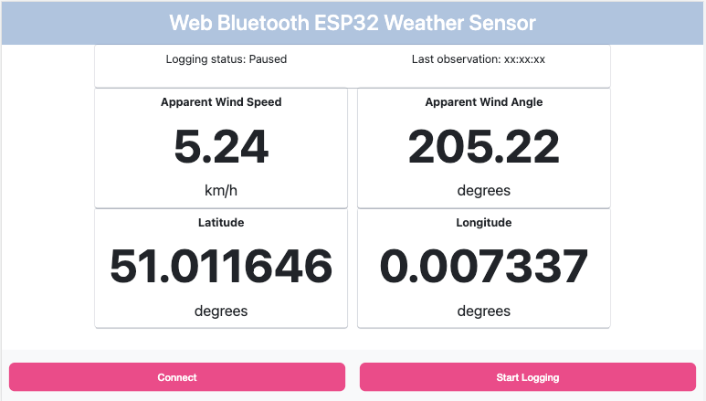

# ESP32 + Web Bluetooth example
*September 2022*

This example is designed to demonstrate the use of ESP32 Micropython together with Web Bluetooth. It could be a useful starting point for someone wishing to build a mobile weather station or similar device based on ESP32. 

There are a few potential advantages of using bluetooth to connect to and control an embedded device. For example, if your use case means that the embedded device is not in range of a WiFi router then you are able to connect to the device whilst still maintaining a cellular connection to the internet. Also, I have found that serving a user-friendly (aesthetically pleasing, feature rich) website from ESP32 tends to be quite slow. The advantage of the Web Bluetooth design pattern is that your website can be served using regular, more powerful, web infrastructure and the embedded device only provides raw data-points and controls. This is far lower overhead. 

Additional benefits include the ability to use whichever web-framework you prefer, rather than trying to coerce your application into a highly modified framework which runs on a resource constrained embedded device (frustrating in my experience). By creating a Bluetooth interface it is a simple matter to extend your use-case with a native iOS or Android app.

Today it would be possible to extend this example with offline support for Android devices as a progressive web app (PWA). Depending on how quickly Web Bluetooth becomes standard it may also be possible to do this for iOS in the future but it is not currently supported by Safari. 

## Important to know before you start

Web Bluetooth is an experimental technology, currently it is supported only by a handful of browsers and not on all operating systems, [this link gives the details](https://developer.mozilla.org/en-US/docs/Web/API/Web_Bluetooth_API#browser_compatibility). As a consequence it is necessary to make a few small configuration tweaks before you try to connect.

I chose **Google Chrome** as it has the best support overall and Google are pushing Web Bluetooth quite hard.

I have tested the example using the following browers + operating systems:
- MacOS 
  - Monterey running on Macbook Pro 13" 2016
  - Google Chrome browser (Safari will not work)
- iOS
  - iOS 16.0 beta running on iPhone 12 Pro Max
  - Bluefy browser (Safari, Chrome iOS will not work)
- Windows
  - laptop running Windows 10
  - Google Chrome browser

**Pre-configuration steps**
1. Allow Chrome on your device to use Bluetooth. On MacOS I had to do this by adding Google Chrome.app to the list of apps with Bluetooth access. You will find this in _System Preferences_ under _Security & Privacy_. I didn't need to do this on my Windows 10 machine. 
2. In Chrome you need to enable the _Bluetooth Scanning_ feature using this URI `chrome://settings/content/bluetoothScanning`
 
Check that your Bluetooth adapter is turned on and that Google Chrome can access Bluetooth and do a trial scan by visiting `chrome://bluetooth-internals/#devices`. If this shows up a list of devices (almost guaranteed unless you live in the stone ages) then you should be set for the rest of the example to work. 

### Requirements

I built this example using the following hardware and software. 

#### ESP32
- Wemos Lolin D32 Pro V2.0.0 with 4MB RAM  
- Micropython v1.19.1 (2022-06-18) with SPIRAM [available here](https://micropython.org/download/esp32spiram/) 
- aioble - used as a high-level asynchronous interface to bluetooth / BLE. Available as part of the

#### Web server
- python 3.10
- flask - for the web server `pip3 install flask`
- pyopenssl - for adhoc ssl certificates `pip3 install pyopenssl`

## Architecture of the example

### ESP32 / Bluetooth device
Implements a single Bluetooth Service which identifies as the _Environmental Sensing_ service as the Primary Service, see [Bluetooth specifications](https://www.bluetooth.com/specifications/specs/environmental-sensing-service-1-0/).

In our example this contains several standard characteristics, each of which can be read or subscribed to for notifications. Times reflect update frequencies:
- temperature sensor (5s)
- longitude (1s)
- latitude (1s)
- apparent wind speed (0.5s)
- apparent wind direction (0.5s)

It's probably not correct to mix characteristics across services, equally it's not clear that we shouldn't do this. 

The ESP32 emulates several asynchronous sensors. Each produces data as a random walk from a given starting point each time the device is rebooted. 

Note that each Bluetooth characteristic is Big Endian encoded using either signed 16 bit integers or signed doubles (64 bits / 8 bytes).

The simulated device will print various messages to REPL which give an indication of what it is doing:
- boot up
- Recording temperature
- When a client connects to the bluetooth device
- When a client disconnects from the bluetooth device and it starts advertising again
- How long the client has been continuously connected, total time since initial boot

### Web page + Bluetooth client
The web page is a simple template, populated initially with placeholders. 

The _Connect_ button triggers user authorisation of the Bluetooth scan and device connection. Once connection is achieved elements of the web page are populated with data from the Bluetooth device. Call back handlers ensure that these are automatically updated based on the embedded device notification / emulated sensor frequency. 

The javascript is somewhat abstracted making it simple to register a new bluetooth characteristic to read and connect this to a data parser and element of the HTML DOM to update with the received value. This part is a useful stub for quickly prototyping features and which I have used in my own work. 

#### Potential enhancements - not implemented (yet!)
- Disconnect gracefully from the bluetooth device and de-register listeners
- Characteristic write capabilities e.g. to trigger functionality, to update RTC on connect 
- Ability to attempt re-connects e.g. through exponential back-off if the device connection is lost
- Handle connections to multiple devices simultaneously

## Installing the example and running it

### ESP32
Flash everything in the folder **ESP32** to the root of the device. This includes the aioble driver.

Restart the device for it to run the example. Connect to REPL if you want to see log messages. 

### Web server - Flask method
Open a terminal at the example root directory and run `python3 app.py`. This will launch the web app on host addresses `0.0.0.0`. As such it should be accessible 
**For security reasons** - only run the example this way if you are behind an adequate firewall! If you only want to only access from localhost then change the run configuration. 

To connect open Google Chrome browser and navigate to one of the two links which flask prints in the terminal. Make sure you use https://

Note that since you are using an adhoc SSL certificate Chrome will complain and you will need to explicitly complete navigation to the webpage. 

### Running the example
1. Click on the _Connect_ button
2. Identify your ESP32 device in the Chrome popup Bluetooth device scan
3. Watch as the Placeholder values get updated with dummy data!  

If everything is working correctly you should see something like the image at the top of the page.

### Troubleshooting
If things don't work as expected you may find helpful messages / errors being printed to the console. Most common problems / solutions I have found include:

**Chrome can't see the Bluetooth device** - check authorizations for your operating system 

**Chrome Bluetooth is not enabled** - check steps above / google

**Flask / other host is not serving as **HTTPS**** - it seems that there are no errors, Chrome just refuses to run the connection routines, unhelpful! 
 
**SSL certificates are corrupted / invalid** - should not happen when using an adhoc certificate but I had many problems with self-signed certificates

**Bluefy does not seem to be able to visit an HTTPS page with an adhoc or self-signed SSL certificate**. The Flask example here therefore does not work but if I use the Github pages approach it works fine. Chrome works with either approach but complains about the crappy SSL cert.  

## Useful resources
As with most first tries I've relied heavily on Google and other people's work as well as a few foundation resources to get to this point. I would therefore recommend also looking at most of the following:

Most helpful:
- [Building a Progressive Web App for communicating with a Bluetooth Low Energy Device](https://medium.com/@j.salonen/building-a-progressive-web-app-for-communicating-with-a-bluetooth-low-energy-device-e1e0a7bd2622) - my original starting point  
- [Communicating with Bluetooth devices over JavaScript](https://web.dev/bluetooth/) - The single most helpful article for building up a working example in JavaScript. Recommend start here!  
- [Adafruit introduction to BLE](https://learn.adafruit.com/introduction-to-bluetooth-low-energy/introduction) - one of several resources like it. not bad.  
- [micropython asynchronous Bluetooth Low Energy driver](https://github.com/micropython/micropython-lib/tree/master/micropython/bluetooth/aioble) - core of this example! I have only lightly adapted it to add extra characteristics and change the _peripheral task_ to remove the annoying timeout task cancellation / crash after 60s.  
- [LightBlue MacOS, iOS, Android apps](https://punchthrough.com/lightblue/) - Seriously useful apps to check that you're not going mad... on app store too.  

Also useful:
- [Start Building with Web Bluetooth and Progressive Web Apps](https://urish.medium.com/start-building-with-web-bluetooth-and-progressive-web-apps-6534835959a6) - useful background reading, goes further than I have in this example  
- [Experimenting with web Bluetooth](https://medium.com/@devdevcharlie/experimenting-with-web-bluetooth-1f1176047ddd) -  
- [micropython Bluetooth documentation](https://docs.micropython.org/en/latest/library/bluetooth.html) - for the low-level bluetooth driver. They recommend using the aioble driver, link below. Having tried both I can agree!  
- [Bluetooth specification](https://www.bluetooth.com/specifications/specs/) - the official site, most uptodate information relating to services, characteristics etc. Like most official specifications, this may not be the easiest starting point!  
- [Web Bluetooth Community Group](https://github.com/WebBluetoothCG) - lots of useful examples  
- [Playing with Bluetooth PAN](https://hackaday.io/project/165940-esp32-ax25aprs-tnc/log/164594-playing-with-bluetooth-pan) - have not tried this yet, potentially interesting but I feel the PWA / web bluetooth route should be superior.  